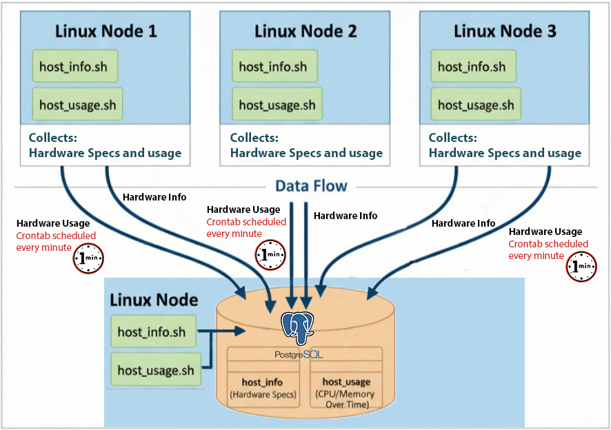

# Linux Cluster Monitoring Agent
## Introduction
This project gives the Jarvis Linux Cluster Administration (LCA) team a way to track their Linux nodes connected through a switch. It collects each node's hardware specs once and then monitors real-time CPU and memory usage. All data is stored in a PostgreSQL database so the team can run queries and analyze performance. The MVP is built using Bash scripts, Git, Docker, psql, Realvnc and GCP.
## Quick Start
### 1. Start PostgreSQL using Docker
```bash

./scripts/psql_docker.sh create
```
### 2. Create database tables
``` bash

psql -h localhost -U postgres -d host_agent -f sql/ddl.sql
```
### 3. Insert hardware specifications
``` bash

./host_info.sh localhost 5432 host_agent postgres your_password
```
### 4. Insert usage data
```bash

./host_usage.sh localhost 5432 host_agent postgres your_password
```

### 5. Set up crontab to run host_usage.sh every minute
```bash

crontab -e
* * * * * bash /path/to/host_usage.sh localhost 5432 host_agent postgres your_password
```

# Implementation

## Architecture
Each Linux host runs two monitoring scripts:
- `host_info.sh` : collects static information about CPU, memory, and disk.
- `host_usage.sh` : collects real-time CPU and memory usage metrics.

All hosts push their data to a single PostgreSQL database running inside a Docker container (`psql_docker.sh`). The database stores the metrics in two tables (`host_info` and `host_usage`) for analysis and reporting.




This diagram above illustrates the Linux Cluster Monitoring Agent setup.


## Scripts 
- `psql_docker.sh` : manages the PostgreSQL container (create/start/stop).
- `host_info.sh` : collects static host specifications and inserts into host_info table.
- `host_usage.sh` : collects live CPU and memory usage and inserts into host_usage table.
- Crontab : schedules `host_usage.sh` to run periodically.

## Database Modeling
The database consists of two main tables: `host_info` and `host_usage`. Below is a concise overview of their structure and relationships.

### `host_info` Table
Stores static information about each Linux host.

| Field       | Type      | Description |
|------------ |---------- |------------|
| **host_id** | SERIAL    | PK         |
| hostname    | TEXT      | Name of the host machine |
| cpu_count   | INT       | Number of CPU cores |
| memory_mb   | INT       | Total memory in megabytes |
| disk_gb     | INT       | Total disk size in gigabytes |

### `host_usage` Table
Stores dynamic, real-time usage metrics.

| Field         | Type       | Description                            |
|---------------|----------- |----------------------------------------|
| **usage_id**  | SERIAL     | PK                |
| host_id       | INT        | Foreign key referencing `host_info`    |
| cpu_percent   | FLOAT      | CPU usage percentage                   |
| memory_mb     | FLOAT      | Memory usage in megabytes              |
| recorded_at   | TIMESTAMP  | Timestamp of when the data was collected |

### Relationships
- Each `host_usage` record references a host in `host_info` through `host_id`.
- This allows tracking usage over time per host and performing historical analytics


# Test
The scripts and database were tested to ensure correct data collection, insertion, and scheduling.

### 1. Test PostgreSQL Container
```bash

docker ps
```
### 2.Test Table Creation
```bash

psql -h localhost -U postgres -d host_agent -c "\dt"
```
### 3. Test Hardware Info Collection
```bash

./host_info.sh localhost 5432 host_agent postgres your_password

psql -h localhost -U postgres -d host_agent -c "SELECT * FROM host_info;"
```
### 4. Test Real-Time Usage Collection
```bash

./host_usage.sh localhost 5432 host_agent postgres your_password

psql -h localhost -U postgres -d host_agent -c "SELECT * FROM host_usage ORDER BY recorded_at DESC LIMIT 5;"
```
### 5. Crontab
Ensure crontab schedules `host_usage.sh` and logs are created.
```bash

crontab -l
```
# Deployment
#### 1. Clone the repository to your local machine or VM.
#### 2. Start PostgreSQL using `./scripts/psql_docker.sh create`.
#### 3. Create tables using `psql -h localhost -U postgres -d host_agent -f sql/ddl.sql`.
#### 4. Run `host_info.sh` and `host_usage.sh` to populate the database.
#### 5. Add `host_usage.sh` to crontab for scheduled data collection.
# Improvements
A good improvement can be to implement an alert for high CPU/memory usage via SMTP.