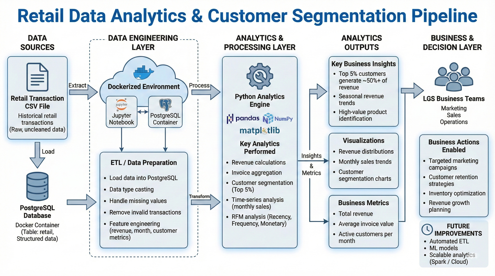

# Python Data Analytics LGS retail project

## Introduction

This project focuses on analyzing historical retail transaction data to support data-driven decision-making for London Gift Shop (LGS), a retail business operating an online sales platform. The dataset contains transactional records such as invoices, products, customers, pricing, quantities, and timestamps.

The primary goal of this project is to transform raw data into meaningful analytical insights:
- Monitor sales performance over time
- Identify high-value customers
- Detect cancellations

This work is implemented using:
- **Python** for data analytics and feature engineering
- **Pandas & NumPy** for data manipulation
- **PostgreSQL** as the data warehouse
- **Jupyter Notebook** for exploratory analysis and visualization
- **Docker** to ensure a consistent and reproducible environment

---

## Implementation

### Project Architecture

The architecture of this project follows a simple data analytics workflow:

1. **Data Source**
    - Retail transactional data stored in a PostgreSQL database
    - Data is loaded via SQL scripts (`retail.sql`) into the database

2. **Data Warehouse**
    - PostgreSQL acts as the centralized data store
    - Tables are queried using SQL for data profiling and validation

3. **Analytics Layer**
    - A Jupyter Notebook connects to PostgreSQL using `psycopg2`
    - Data is loaded into Pandas DataFrames for analysis and transformation

4. **Analytics Output**
    - Metrics (sales, revenue, users)
    - Time-based features (monthly sales, growth)
    - Customer-level features (RFM metrics)

5. **Usage by LGS**
    - Business teams can use insights to design targeted marketing campaigns
    - Data teams can reuse engineered features for ML models
    - Results can be integrated into dashboards or reporting tools

**Architecture Diagram**

---

### Data Analytics and Wrangling

The core analytics work is implemented in the following notebook:

**[Retail Data Analytics & Wrangling Notebook](./retail_data_analytics_wrangling.ipynb)**

In this notebook, the following steps are performed:

- Load retail transaction data from PostgreSQL into Pandas
- Perform data profiling and exploratory analysis
- Clean and transform raw data.
- Engineer new features such as:
    - Invoice amount
    - Monthly sales
    - Active users
    - New vs existing customers
    - RFM (Recency, Frequency, Monetary) metrics

### How This Data Helps LGS Increase Revenue

The analytical results from this project enable LGS to:

- **Identify high-value customers** using RFM analysis and focus retention efforts on them
- **Detect seasonal trends** and plan inventory and promotions accordingly
- **Analyze cancellations** to reduce refunds and operational losses
- **Design targeted marketing campaigns** based on customer behavior and purchase frequency

---

## Improvements

If more time were available, the following improvements could be made:

1. **Build automated ETL pipelines**
    - Schedule data ingestion and transformation using tools like Airflow 

2. **Deploy machine learning models**
    - Train and deploy models for customer segmentation, demand forecasting

---

